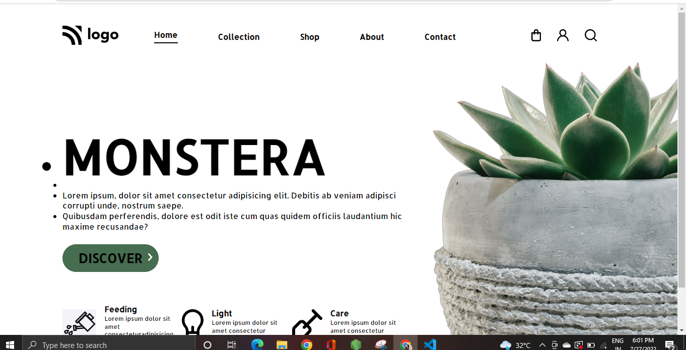

# Plant Homepage.
Plant Homepage project is a part of Full-stack Developement Program by Ineuron and I learn a lot from these Project.
 ## Netlify
 [Live](https://plant-homepage-project.netlify.app/)

# I learn...
* Box model Basics.
* Different types of selectors and use case.
* Position in css.

# Screenshot of the project.

## Thanks:
Ineuronai 
